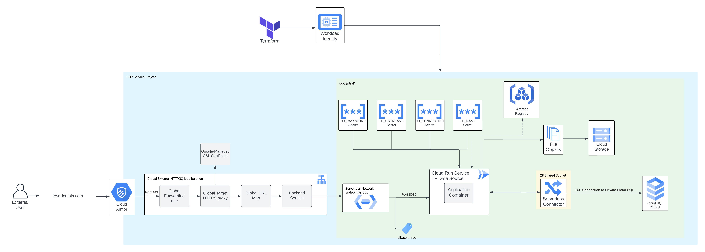

# Cloud Run Deployment Pattern with Terraform Cloud & GitHub Actions
## Designed for larger enterprises in regulated environments

This repository handles the basic deployment of containerized application on Cloud Run, along with a Global External Load Balancer and IAM for the service.

The resources/services/activations/deletions that this module will create/trigger are: 

* Creates a Global External HTTPS load balancer in front of an existing Cloud Run service.  
* Pulls a Terraform Data Source for Cloud Run. *NOTE: If a Cloud Run instance does not already exist, this repository can create a helloworld container on the fly in the GitHub Actions Workflow. This instance would then be replaced by your applications first revision.* 
* Creates a Cloud SQL instance, SQL Server dialect, with relevant databases and stores connection information securely in Secret Manager. 
* Applies a tag for excluding the Cloud Run service from Domain Restricted Sharing organization policy.
* Applies the role grant on *allUsers* to have the *roles/run.invoker* role, allowing any user to invoke the Cloud Run service.
* Creates an Artifact Registry repository to store Docker images. 
* Creates a serverless connector to route all Cloud Run traffic through.

## Architecture Diagram

## Assumptions and Prerequisites 

This repository assumes that the below mentioned prerequisites are in place before consuming the module. 

* All required APIs are enabled in the GCP Project.
* Terraform workspace has been created and the team token is stored in Github secrets.
* Workload Identity Federation has been set up 
* A Shared VPC exists and the project where these resources will be deployed is a *service project*. 
* The /modules folder mimics the private module registry available for enterprise organizations. This is meant to emulate the clone & own strategy some enterprises follow with respect to open source modules. 
* /28 subnet has been shared with service project.
* The service account that will deploy all resources through Terraform has the roles mentioned in the following section.

## Project Roles Required for Terraform Service Account

* roles/artifactregistry.admin
* roles/cloudsql.admin
* roles/instanceAdmin.v1
* roles/iam.projectIamAdmin
* roles/compute.loadBalancerAdmin
* roles/iam.workloadIdentityPoolAdmin
* roles/artifactregsitry.admin 

### Roles Required on Specific Resources
* roles/resourcemanager.tagUser is required on the tag key/value resource. 
*Note: If this role is granted as a project role and the tags were created at the organization or folder level, the identity will not be able to use it. It is important to note to grant this role on the resource itself.* 

## GitHub Secrets 

## Required APIs
* artifactregistry.googleapis.com
* monitoring.googleapis.com
* run.googleapis.com
* pubsub.googleapis.com
* storage-component.googleapis.com
* certificatemanager.googleapis.com
* dns.googleapis.com
* iamcredentials.googleapis.com
* container.googleapis.com
* iam.googleapis.com
* logging.googleapis.com
* sql-component.googleapis.com
* sqladmin.googleapis.com
* vpcaccess.googleapis.com
* serviceusage.googleapis.com
* cloudresourcemanager.googleapis.com

## How to use this repository
### General Repository Usage
1. Fork this repository or copy the code into your own repository. 
2. 
### Terraform Deployment
1. 

