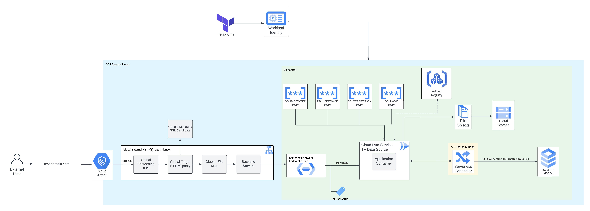
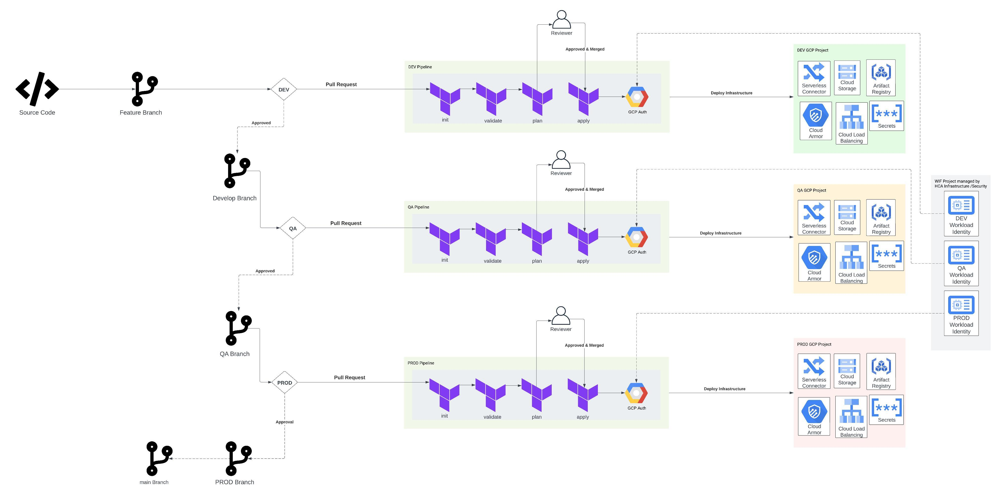

# Cloud Run Deployment Pattern with Terraform Cloud & GitHub Actions
This Cloud Run Deployment Pattern is designed for large enterprises with strict regulations and governance. It demonstrates how to deploy Terraform for infrastructure and maintain a separate workflow for application code. These pipelines are separate because application code will likely have a higher velocity of change than infrastructure. This separation also helps limit the potential impact of failures in CI/CD pipelines.

## Terraform Workflow
**The following information is specific to the Terraform workflow, please see towards the bottom for information specific to the application code workflow. The IaC should be executed first, hence the ordering.** 

The actions that this repository will execute are: 

* Create a Global External HTTPS load balancer in front of an existing Cloud Run service.  
* Pull a Terraform Data Source for Cloud Run. *NOTE: If a Cloud Run instance does not already exist, this repository can create a helloworld container on the fly in the GitHub Actions Workflow. This instance would then be replaced by your applications first revision.* 
* Create a Cloud SQL instance, SQL Server dialect, with relevant databases, public IP and private IP. 
* Stores connection information securely in Secret Manager. 
* Apply a tag for excluding the Cloud Run service from Domain Restricted Sharing organization policy.
* Apply the role grant on *allUsers* to have the *roles/run.invoker* role, allowing any user to invoke the Cloud Run service.
* Create an Artifact Registry repository to store Docker images. 
* Create a serverless connector to route all Cloud Run traffic through.

### Architecture Diagrams
#### Terraform Deployment


#### Terraform Branching Strategy 


### Prerequisites 
#### Assumptions
This repository assumes that the below mentioned prerequisites are in place before consuming the module. 

* All required APIs are enabled in the GCP Project.
* Terraform workspace has been created and the team token is stored in Github secrets.
* Workload Identity Federation has been set up and the service account connected. 
* A Shared VPC exists and the project where these resources will be deployed is a *service project*. 
* The /modules folder mimics the private module registry available for enterprise organizations. This is meant to emulate the clone & own strategy some enterprises follow with respect to open source modules. 
* /28 subnet has been shared with service project.
* The service account that will deploy all resources through Terraform has the roles mentioned in the following section.


#### Project Roles Required for Terraform Service Account
* roles/artifactregistry.admin
* roles/cloudsql.admin
* roles/instanceAdmin.v1
* roles/iam.projectIamAdmin
* roles/compute.loadBalancerAdmin
* roles/iam.workloadIdentityPoolAdmin
* roles/artifactregsitry.admin 

#### Project Roles Required for GitHub Workload Identity Service Account
* roles/artifactregistry.writer
* roles/run.admin

#### Roles Required on Specific Resources
* roles/resourcemanager.tagUser 
*Note: If this role is granted as a project role and the tags were created at the organization or folder level, the identity will not be able to use it. It is important to note to grant this role on the resource itself.* 


#### GitHub Secrets 
The following GitHub secrets must be added to the repository. These secrets can be added per environment to ensure separation.  
* **TF_API_KEY** - Terraform API Key to authenticate from GitHub Actions to Terraform Cloud. 
* **WIF_PROVIDER** - Workload Identity Federation provider fully qualified name. *e.g. projects/123456789/locations/global/workloadIdentityPools/my-pool/providers/my-provider*
* **WIF_SERVICE_ACCOUNT** - Workload Identity Federation connected Service Account. 


#### Required APIs
* artifactregistry.googleapis.com
* monitoring.googleapis.com
* run.googleapis.com
* pubsub.googleapis.com
* storage-component.googleapis.com
* certificatemanager.googleapis.com
* dns.googleapis.com
* iamcredentials.googleapis.com
* container.googleapis.com
* iam.googleapis.com
* logging.googleapis.com
* sql-component.googleapis.com
* sqladmin.googleapis.com
* vpcaccess.googleapis.com
* serviceusage.googleapis.com
* cloudresourcemanager.googleapis.com


## How to use this repository to deploy infrastructure
### General Repository Usage
1. Create a bare clone of this repository.
```
git clone --bare https://github.com/chasinandrew/cloud-run-reference-architecture.git
```
2. Mirror push to the new repository. 
```
cd OLD-REPOSITORY.git
git push --mirror https://github.com/YOUR-ORG/cloud-run-reference-architecture.git
```

3. Remove the temporary local files. 
```
cd ..
rm -rf OLD-REPOSITORY.git
```

### Terraform Deployment
1. Ensure your workspace is set up to authenticate with workload identity federation as shown in this documentation.
2. 

