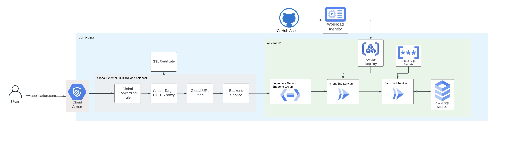

# Cloud Run Deployment Pattern with Terraform Cloud & GitHub Actions 

This repository handles the basic deployment of containerized application on Cloud Run, along with a Global External Load Balancer and IAM for the service.

The resources/services/activations/deletions that this module will create/trigger are: 

* Creates a Cloud Run service with provided name, application code and optional parameters for the container
* Creates a Global HTTPS load balancer with a Google-managed SSL certificate, forwarding rule, URL map and serverless network endpoint group
* Applies a tag for excluding the Cloud Run service from Domain Restricted Sharing organization policy
* Creates a Cloud Storage bucket if needed within your application 
* Prepares Cloud Run instance for connection to Cloud SQL instances with environment variables and Secrets Manager
* Deployment pipeline facilitates the container image build and push to Artifact Registry

## Architecture Diagram

## Assumptions and Prerequisites 

This repository assumes that the below mentioned prerequisites are in place before consuming the module. 

* All required APIs are enabled in the GCP Project
* Terraform workspace has been created and the team token is stored in Github secrets
* Workload Identity Federation is configured for the service account to authenticate from Github and Terraform Cloud
* Github secrets are created for **TF_API_TOKEN**, **WIF_PROVIDER**, **WIF_SA**
* Artifact Registry repository has been created
* Static external IP address has been reserved 
* DNS A record has been created with the external IP address and domain name to be used for Cloud Run 
* Cloud SQL (optional) 
* VPC Connector in the Shared VPC network host project (optional)
* Secrets created and stored in Secrets Manager or HashiCorp Vault (optional)

## Required APIs
* artifactregistry.googleapis.com
* monitoring.googleapis.com
* run.googleapis.com
* pubsub.googleapis.com
* storage-component.googleapis.com
* certificatemanager.googleapis.com
* dns.googleapis.com
* iamcredentials.googleapis.com
* container.googleapis.com
* iam.googleapis.com
* logging.googleapis.com
* sql-component.googleapis.com
* sqladmin.googleapis.com
* vpcaccess.googleapis.com
* serviceusage.googleapis.com
* cloudresourcemanager.googleapis.com

## Permissions Required for Terraform Service Account

* roles/artifactregistry.admin
* roles/cloudsql.admin
* roles/instanceAdmin.v1
* roles/iam.projectIamAdmin
* roles/compute.loadBalancerAdmin
* roles/iam.workloadIdentityPoolAdmin
* roles/artifactregsitry.writer 
* roles/resourcemanager.tagUser

## How to use this repository

